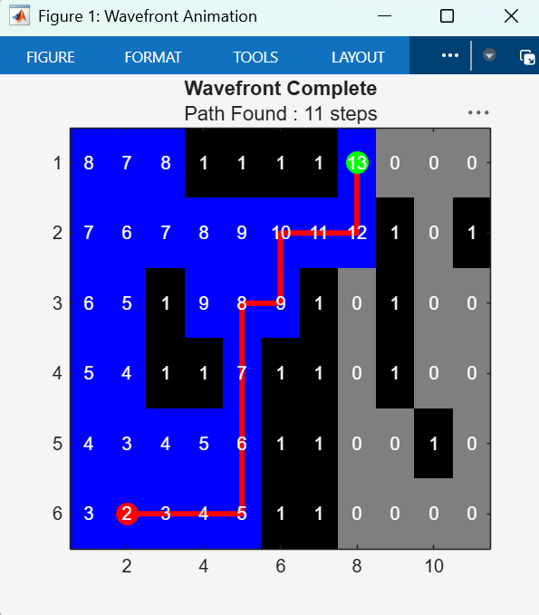
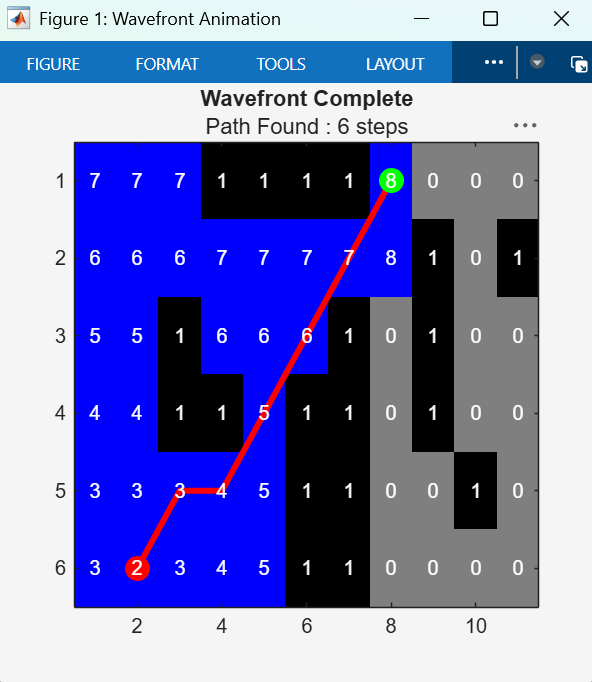
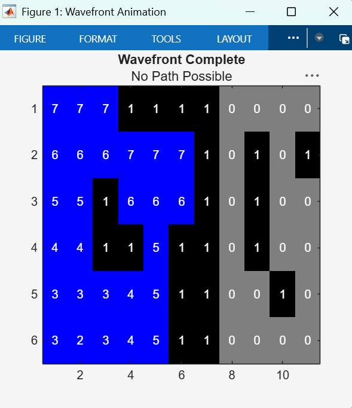
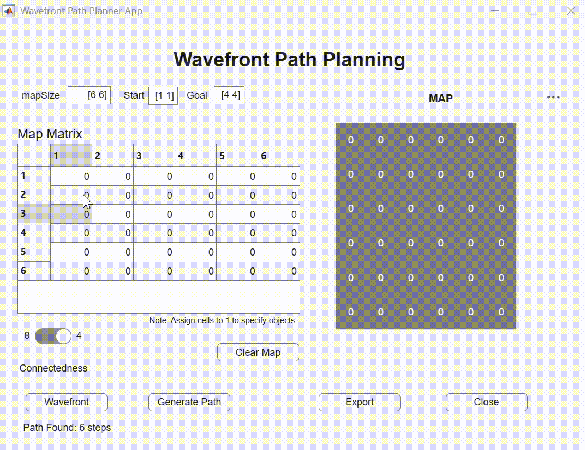
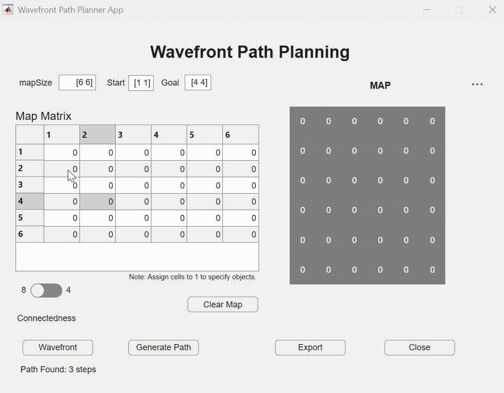
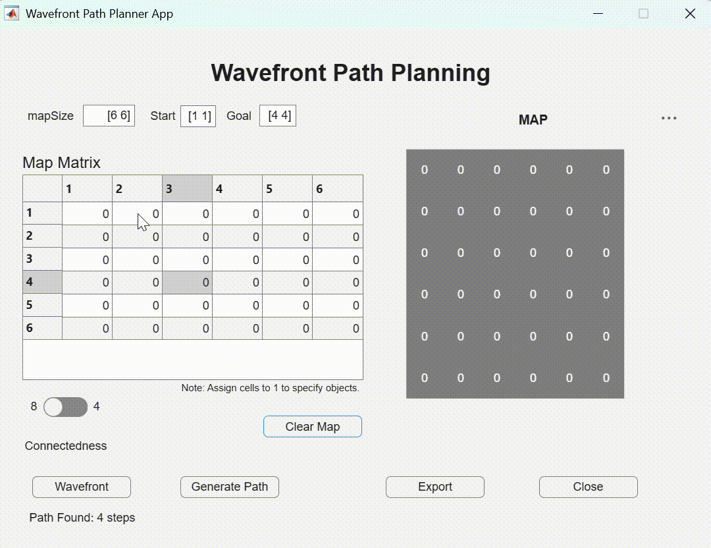

# Wavefront Path Planner MATLAB

Implementing the Wavefront (Grassfire) path planning algorithm. This repository includes a modular function, an interactive GUI application, and a Live Script for educational purposes.

## 📖 What is the Wavefront Algorithm?
The **Wavefront Path Planner** is a grid-based navigation technique used in robotics to find the shortest path from a starting point to a goal. 

It operates in two distinct phases:
1.  **Wave Propagation:** Starting at the goal, the algorithm assigns an increasing "cost" value to adjacent free cells. This "wave" spreads across the grid until it reaches the start point.
2.  **Backtracking:** From the start point, the agent follows the steepest descent (moving to the neighbor with the lowest cost) until it reaches the goal.

## 🛠️ Repository Overview
This project provides three distinct ways to utilize the algorithm:
*   **`wavefront_planner.m`**: A modular MATLAB function for integration into external scripts.
*   **`waveFront_Algorithm_App.mlapp`**: An interactive GUI for building maps and visualizing the wave in real-time.
*   **`wavefront_path_planner.mlx`**: A Live Script that breaks down the math and logic step-by-step.

---

## ⚡ Algorithm Visualization

### **4-Connectedness vs. 8-Connectedness**
The algorithm supports different neighbor connectivity, which dictates how the "wave" spreads.

*   **4-Connected:** Moves only Up, Down, Left, and Right (Manhattan distance).
*   **8-Connected:** Includes diagonal movements (Chebyshev distance), resulting in shorter, more direct paths.

| 4-Connectedness | 8-Connectedness |
| :--- | :--- |
|  |  |

### **Obstacle Handling & Blocked Paths**
The planner intelligently navigates around objects (Value = 1). If the goal is completely enclosed by obstacles, the algorithm will terminate and notify the user that no path is possible.



---

## 💻 Function Usage
The core logic is contained in `wavefront_planner.m`. This is ideal for research or larger simulation projects where a GUI is not required.

```matlab
% Example: Planning a path on a 10x10 grid
map = zeros(10, 10);     
map(3:7, 5) = 1;         % Create a vertical wall obstacle
start = [1, 1];
goal = [10, 10];
connectivity = 8;        % Choose 4 or 8

% Run the planner
[path, costMap, pathLen] = wavefront_planner(map, start, goal, connectivity);
```
## 📱 Interactive MATLAB App

The **Wavefront Path Planning App** provides a user-friendly interface for real-time experimentation. It allows users to dynamically build maps, place obstacles, and visualize the propagation and backtracking phases.

### **Key Features:**
*   **Dynamic Grid:** Adjust map size and Start/Goal coordinates instantly.
*   **Interactive Obstacles:** Toggle obstacles (1) and free space (0) directly in the "Map Matrix" table.
*   **Live Visualization:** Watch the wave propagate numerically across the grid using `drawnow` animations.
*   **Data Export:** Save the `CostMap`, `Path`, and `Length` to the MATLAB Workspace for further analysis.

---

### **Simulation Scenarios**

Below are the visual demonstrations of the algorithm in different configurations.

#### **1. 8-Connectedness (Diagonal Movement)**
*In this mode, the "wave" spreads to all 8 neighbors, allowing for diagonal traversal and shorter path lengths.*



#### **2. 4-Connectedness (Manhattan Movement)**
*Movement is restricted to cardinal directions (Up, Down, Left, Right). The resulting path follows a "city-block" geometry.*



#### **3. Blocked Path Handling**
*If obstacles completely enclose the Goal or Start, the algorithm detects that the wave cannot reach its destination and notifies the user.*


